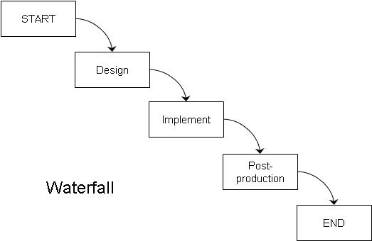

## Overview

Last time we asked the question: what is a game? Today, we look into a related question: what, exactly, is game design? Last time, we made a simple game. This time, we will look into the process of how games are made in general. While it is possible to make a race-to-the-end board game in 15 minutes, you will need to take a little longer if you are looking to make the next _Settlers of Catan_ or _World of Warcraft_.

## Game Design

We will use the word “design” a lot in this course, and unfortunately it is a term that is a bit overused, so I will clarify what I mean here. As it says in _Challenges_, game design is the creation of the rules and content of a game. It __does not__ involve programming, art or animation, or marketing, or any of the other myriad tasks required to make a game. All of these tasks collectively can be called “game development” and game design is one part of development.

Unfortunately, I have seen the term “design” used (particularly in some college curricula) to refer to all aspects of development. When used in the video game industry (or the board game industry), “game design” has a very specific meaning, and that is the meaning that we will use for this course.

## Multiple Types of Game Design

As mentioned in _Challenges_, there are many tasks associated with game design: system design, level design, content design, user interface design, world building, and story writing. You could fill several 10-week courses with any one of these, so this summer course will not be a full treatment of the entire range of game design. We will touch lightly on UI, story writing and content when relevant, but the majority of this course focuses on __system design__ (also sometimes called “systems design” or “core systems design”).

System design is about defining the basic rules of the game. What are the pieces? What can you control? What actions can you take on your turn (if there are “turns” at all)? What happens when you take each action, and how does it affect the game state? In general, system design is the creation of three things:

- Rules for setup. How does the game begin?
- Rules for progression of play. Once the game begins, what can the players do, and what happens when they do things?
- Rules for resolution. What, if anything, causes the game to end? If the game has an outcome (such as winning or losing), how is that outcome determined?

If you look back at _Three-to-Fifteen_ from Monday, you’ll notice those very simple rules contain all of these parts. The creation of those rules is system design, and that is what we will be spending most of our time with over this summer.

## What is a Game Designer?

As you may have noticed, game design is an incredibly broad field. Those of us who are professional designers sometimes have trouble explaining what we do to our families and friends. Part of the reason for this is that we do so many things. Here are some analogies I’ve seen when trying to explain what it is like to be a game designer:

- Game designers are __artists__. The term “art” is just as difficult to define as the word “game”… but if games can be a form of art (as we saw in Costikyan’s definition, at least), then designers would be artists.

- Game designers are __architects__. Architects do not build physical structures; they create blueprints. Video game designers also create “blueprints” which are referred to as “design docs.” Board game designers create “blueprints” as well — in the form of prototypes — which are then mass-produced by publishers.

- Game designers are __party hosts__. As designers, we invite players into our space and try our best to show them a good time.

- Game designers are __research scientists__. As I will touch on later today, we create games in a manner that is very close to the scientific method.

- Game designers are __gods__. We create worlds, and we create the physical rules that govern those worlds.

- Game designers are __lawyers__. We create a set of rules that others must follow.

- Game designers are __educators__. As we will see later when we start reading _Theory of Fun_, entertainment and education are strongly linked, and games are (at least sometimes) fun because they involve learning new skills.

If game design is all these things, where would it fit in a college curriculum? It could be justified in the school of education, or art, or architecture, or theology, or recreation management, or law, or engineering, or applied sciences, or half a dozen other things.

Is a game designer all of these things? None of them? It is open for discussion, but I think that game design has elements of many other fields, but it is still its own field. And you can see just how broad the field is! As the field of game design advances, we may see a day where game designers are so specialized that “game design” will be like the field of “science” — students will need to pick a specialty (Chemistry, Biology, Physics, etc.) rather than just “majoring in Science.”

## Speaking of Science...

How is a game designed? There are many methods.

Historically, the first design methodology was known as the __waterfall__ method: first you design the entire game on paper, then you implement it (using programming in a video game, or creating the board and pieces for a non-digital game), then you test it to make sure the rules work properly, add some graphical polish to make it look nice, and then you ship it.

Waterfall is so named because, like water in a waterfall, you can only move in one direction. If you’re busy making the final art for the game and it occurs to you that one of the rules needs to change, too bad — the methodology does not include a way to go back to the design step once you are done.